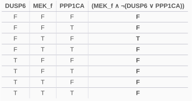
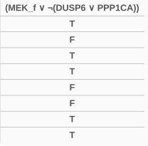

```{r Render command, eval=FALSE, include=FALSE}
#rmarkdown::render(input = "./cascade_synergy_biomarkers.Rmd", output_format = "html_document", output_dir = "../../docs/cascade/cell-lines-2500/")
```

## Intro {-}

The purpose of this analysis is to find synergy biomarkers using the [emba R package](https://github.com/bblodfon/emba) in the cascade boolean model datasets (the *cascade* is the name of the topology used). 
More specifically, we will investigate the two synergies: `AK-PD`, `PD-PI` and try to find causal mechanisms that might explain why and where (pathways) these synergies manifest. 

Note that `AK` is an **AKT inhibitor** and `PI` is a **PI3K inhibitor** and they both target the **PI3K/AKT/mTOR pathway**. The combination of such an inhibitor with a **MEK inhibitor** - `PD` - that targets the **MAPK/ERK pathway**, has proven to be more effective than the single drug treatment during clinical trials with patients that had advanced colorectal carcinoma ([source](https://clinicaltrials.gov/ct2/show/NCT01333475)).

The boolean model datasets are in total $9$: one for each cell line 
of interest (8 cell lines) where the models were **fitted to a specific steady state** in each 
case and one for the so-called **random models** which were generated *randomly* in 
the sense that were fitted only to a proliferation state (simulations were done using 
the DrugLogics software modules `Gitsbe` and `Drabme`).

```{r Load libraries, message = FALSE, echo = FALSE}
library(emba)
library(usefun)
library(ComplexHeatmap)
library(circlize)
library(DT)
```

## Input {-}

First we load the cell-specific input data:
```{r Cell-specific Input, cache=TRUE}
# Cell Lines
cell.lines = c("A498", "AGS", "DU145", "colo205", "SW620", "SF295", "UACC62", "MDA-MB-468")

cell.line.dirs = sapply(cell.lines, function(cell.line) {
  paste0(getwd(), "/", cell.line)
})

# Model predictions
model.predictions.files = sapply(cell.line.dirs, function(cell.line.dir) {
  paste0(cell.line.dir, "/model_predictions")
})

model.predictions.per.cell.line = lapply(model.predictions.files, function(file) {   
  get_model_predictions(file) 
})

# Observed synergies
observed.synergies.files = sapply(cell.line.dirs, function(cell.line.dir) {
  paste0(cell.line.dir, "/observed_synergies")
})

observed.synergies.per.cell.line = lapply(observed.synergies.files, function(file) {
  get_observed_synergies(file)
})

# Models Stable State (1 per model)
models.stable.state.files = sapply(cell.line.dirs, function(cell.line.dir) {
  paste0(cell.line.dir, "/models_stable_state")
})

models.stable.state.per.cell.line = lapply(models.stable.state.files, function(file) { 
  as.matrix(read.table(file, check.names = FALSE))
})

# Models Link Operators
models.link.operator.files = sapply(cell.line.dirs, function(cell.line.dir) {
  paste0(cell.line.dir, "/models_link_operator")
})

models.link.operators.per.cell.line = lapply(models.link.operator.files, function(file) {
  as.matrix(read.table(file, check.names = FALSE))
})
```

The random model input data:
```{r Random model Input}
random.dir = paste0(getwd(), "/random")
random.model.predictions = get_model_predictions(paste0(random.dir, "/model_predictions"))

random.models.stable.state = as.matrix(
  read.table(file = paste0(random.dir, "/models_stable_state"), check.names = FALSE)
)

random.models.link.operator =
  as.matrix(read.table(file = paste0(random.dir, "/models_link_operator"), check.names = FALSE))

# the node names used in our analysis
node.names = colnames(random.models.stable.state)
# the tested drug combinations
drug.combos = colnames(random.model.predictions)
```

## Synergy Biomarker Analysis {-}

Using the generic function `biomarker_synergy_analysis` from the [emba R package](https://github.com/bblodfon/emba), we can find
*synergy biomarkers* i.e. nodes whose activity and boolean equation parameterization (link operator) affect the manifestation of synergies in the boolean models. Models are classified based on whether they predict or not each of the predicted synergies found in each boolean dataset.

First we run the analysis on the **cell-specific boolean model datasets** (note 
that every input to the `biomarker_synergy_analysis` function changes per cell line):
```{r Cell-specific Models - Synergy Biomarker Analysis, cache = TRUE}
cell.specific.synergy.analysis.res = list()

for (cell.line in cell.lines) {
  cell.specific.synergy.analysis.res[[cell.line]] =
    biomarker_synergy_analysis(model.predictions.per.cell.line[[cell.line]],
      models.stable.state.per.cell.line[[cell.line]], 
      models.link.operators.per.cell.line[[cell.line]],
      observed.synergies.per.cell.line[[cell.line]], threshold = 0.7)
}
```

Next we run the analysis on the **random boolean model datasets** (note 
that the only input to the `biomarker_synergy_analysis` function that changes
is the observed synergies per cell line - the rest is the same data from the 
random model dataset):
```{r Random Models - Synergy Biomarker Analysis, cache = TRUE}
# Synergy Biomarkers for cell proliferation models
random.synergy.analysis.res = list()

for (cell.line in cell.lines) {
  random.synergy.analysis.res[[cell.line]] =
    biomarker_synergy_analysis(random.model.predictions, 
      random.models.stable.state, random.models.link.operator, 
      observed.synergies.per.cell.line[[cell.line]], threshold = 0.7)
}
```

## Observed synergies {-}

Each of the cell lines studied has a different set of observed synergies (drug 
combinations that were found synergistic across all the 
`r length(drug.combos)` tested ones). In this section, we will 
**visualize the cell lines' observed synergies and mark the synergies that were 
also predicted by the cell-specific models and the random-generated ones**. 
First, we get the biomarkers for these synergies from each cell line:
```{r Total predicted synergies by the cell-specific models}
total.predicted.synergies.cell.specific =
  unique(unlist(sapply(cell.specific.synergy.analysis.res, function(x) { x$predicted.synergies})))
total.predicted.synergies.cell.specific.num = length(total.predicted.synergies.cell.specific)
```

The same for the random models:
```{r Total predicted synergies by the random models}
total.predicted.synergies.random = 
  unique(unlist(sapply(random.synergy.analysis.res, function(x) { x$predicted.synergies})))
total.predicted.synergies.random.num = length(total.predicted.synergies.random)
```

Then, we get the observed synergies from each cell line in a `data.frame`:
```{r Observed synergies per cell line}
observed.synergies.res = get_observed_synergies_per_cell_line(cell.line.dirs, drug.combos)

# remove drug combinations which are not observed in any of the cell lines
observed.synergies.res = prune_columns_from_df(observed.synergies.res, value = 0)

total.observed.synergies = colnames(observed.synergies.res)
total.observed.synergies.num = length(total.observed.synergies)
```

Lastly, we visualize the observed and predicted synergies for all cell lines 
in one heatmap:
```{r Observed synergies heatmap, fig.height = 5, fig.width = 9, dpi = 300, cache = TRUE}
# color the cell-specific predicted synergies
predicted.synergies.colors = rep("black", total.observed.synergies.num)
names(predicted.synergies.colors) = total.observed.synergies
common.predicted.synergies = intersect(total.predicted.synergies.cell.specific,
                                       total.predicted.synergies.random)
cell.specific.only.predicted.synergies = 
  total.predicted.synergies.cell.specific[!total.predicted.synergies.cell.specific %in% total.predicted.synergies.random]
random.only.predicted.synergies = 
  total.predicted.synergies.random[!total.predicted.synergies.random %in% total.predicted.synergies.cell.specific]

predicted.synergies.colors[total.observed.synergies %in% 
                           common.predicted.synergies] = "blue"
predicted.synergies.colors[total.observed.synergies %in% 
                           cell.specific.only.predicted.synergies] = "orange"
predicted.synergies.colors[total.observed.synergies %in% 
                           random.only.predicted.synergies] = "purple"

# define a coloring
obs.synergies.col.fun = colorRamp2(c(0, 1), c("red", "green"))

observed.synergies.heatmap = 
  Heatmap(matrix = as.matrix(observed.synergies.res), 
          col = obs.synergies.col.fun,
          column_title = "Observed synergies per cell line",
          column_title_gp = gpar(fontsize = 20),
          column_names_gp = gpar(col = predicted.synergies.colors),
          row_title = "Cell Lines", row_title_side = "left",
          row_dend_side = "right", row_names_side = "left",
          rect_gp = gpar(col = "black", lwd = 0.3),
          heatmap_legend_param = list(at = c(1, 0), labels = c("YES", "NO"), 
            color_bar = "discrete", title = "Observed", direction = "vertical"))

lgd = Legend(at = c("Cell-specific", "Random", "Both"), title = "Predicted", 
             legend_gp = gpar(fill = c("orange", "purple", "blue")))

draw(observed.synergies.heatmap,  heatmap_legend_list = list(lgd), 
     heatmap_legend_side = "right")
```

<div class = "blue-box">
- The *cell-specific* models predicted `r total.predicted.synergies.cell.specific.num` 
of the `r total.observed.synergies.num` observed synergies found across the 
`r length(cell.lines)` cell lines, whereas the *random* models predicted 
`r total.predicted.synergies.random.num` of the them.
Thus, the **total true positive coverage for all the models across all cell lines is 
`r (length(union(total.predicted.synergies.cell.specific, total.predicted.synergies.random))/total.observed.synergies.num)*100`%**
- Note that there exist synergies which were observed in all cell lines (`AK-BI`,
`PI-D1`)
- `AK-G4` and `5Z-D1` are observed synergies that only the cell-specific models could predict, whereas the `G2-P5` and `PI-D4` are observed synergies that only the random models could predict. This shows us that a **complimentary
approach** is needed when searching for biomarkers as the two different kind of 
models (trained to a specific activity state profile vs trained to proliferation)
although they share common true positives regarding the synergies they predict,
there are also synergies only a specific class of models could predict.
- The two synergies of interest, `AK-PD` and `PD-PI`, were observed in the `A498`
cell line and predicted by both the cell-specific and random models.
</div>

## AK-PD biomarkers {-}

The `AK-PD` synergy was predicted by both the cell specific and random models in the `A498` cell line.

### Cell-specific {-}

We get the average state and link operator differences per network node for the `A498` cell line from the cell-specific models:

```{r AK-PD diff (Cell specific models - A498)}
AK.PD.avg.state.diff.cell.specific = cell.specific.synergy.analysis.res$A498$diff.state.synergies.mat["AK-PD", ]
AK.PD.avg.link.diff.cell.specific  = cell.specific.synergy.analysis.res$A498$diff.link.synergies.mat["AK-PD", ]
```

We build the network from the topology file:

```{r Network building}
topology.file = paste0(getwd(), "/topology")
net = construct_network(topology.file = topology.file, models.dir =  paste0(getwd(), "/AGS/models"))

# a static layout for plotting the same network always
coordinates.file = paste0(getwd(), "/network_xy_coordinates")
nice.layout = as.matrix(read.table(coordinates.file))
```

We will now visualize the nodes average state differences in a network graph. Note that the **good models** are those that predicted the `AK-PD` drug combination to be *synergistic* and were contrasted to those that predicted it to be *antagonistic* (**bad models**). The number of models in each category were:

```{r Count good vs bad models for AK-PD synergy (cell-specific models), results='asis'}
model.predictions = model.predictions.per.cell.line[["A498"]]
models.stable.state = models.stable.state.per.cell.line[["A498"]]
drug.comb = "AK-PD"

good.models.num = sum(model.predictions[, drug.comb] == 1 & !is.na(model.predictions[, drug.comb]))
bad.models.num  = sum(model.predictions[, drug.comb] == 0 & !is.na(model.predictions[, drug.comb]))

pretty_print_string(paste0("Number of models (AK-PD synergistic) in the A498 cell line: ", good.models.num))
pretty_print_string(paste0("Number of models (AK-PD antagonistic) in the A498 cell line: ", bad.models.num))
```

```{r AK-PD activity state biomarkers (Cell specific models - A498), cache = TRUE}
plot_avg_state_diff_graph(net, diff = AK.PD.avg.state.diff.cell.specific, 
  layout = nice.layout, title = "AK-PD activity state biomarkers (Cell specific models - A498)")
```

Thus, we can identify the active state biomarkers:

```{r AK-PD active state biomarkers (Cell specific models - A498), results = 'asis'}
AK.PD.active.biomarkers = AK.PD.avg.state.diff.cell.specific[AK.PD.avg.state.diff.cell.specific > 0.7]
pretty_print_vector_names(AK.PD.active.biomarkers)
```

So, the `AK-PD` synergy manifests in cancer cell models that have the `ERK_f` family logical node in an **active** state.
The **MAPK-ERK signaling pathway** has been studied a lot and has been found to be **overexpressed/have increased activity** in cancers and as such cancer treatments that include the inhibition of that pathway are found to be most beneficial.

Paper evidence for **`ERK` overexpression** in cancer: 

- [Roles of the Raf/MEK/ERK pathway in cell growth, malignant transformation and drug resistance](https://doi.org/10.1016/j.bbamcr.2006.10.001)
- [The Ras/Raf/MEK/ERK signaling pathway and its role in the occurrence and development of HCC (Review)](https://doi.org/10.3892/ol.2016.5110)
- [Targeting ERK, an Achilles' Heel of the MAPK pathway, in cancer therapy](https://doi.org/10.1016/j.apsb.2018.01.008)
- [ERK is a Pivotal Player of Chemo-Immune-Resistance in Cancer](https://doi.org/10.3390/ijms20102505)
- Others???

The inhibited state biomarkers are:

```{r AK-PD inhibited state biomarkers (Cell specific models - A498), results = 'asis'}
AK.PD.inhibited.biomarkers = AK.PD.avg.state.diff.cell.specific[AK.PD.avg.state.diff.cell.specific < -0.7]
pretty_print_vector_names(AK.PD.inhibited.biomarkers)
```

If we check the logical equations related to the above biomarkers we see that:

```{r print equations, results='asis'}
pretty_print_string("ERK_f *=  (  MEK_f ) AND/OR NOT  (  ( DUSP6 )  or PPP1CA )")
pretty_print_string("GAB_f *=  (  GRB2 ) AND/OR NOT ( ERK_f )")
pretty_print_string("PTPN11 *=  (  GAB_f )")
```

So, pretty much if the `GAB_f` node is more inhibited in the models that predicted the `AK-PD` synergy (good models), then `PTPN11` is also as well. 
Also the average activity difference of the `GRB2` node is `r AK.PD.avg.state.diff.cell.specific["GRB2"]`, which makes the `GAB_f` node more inhibited in the good models since it's activity is mostly dependent on the `ERK_f` node, which is mostly activated in the good models.
All in all, the overexpression of `ERK_f` is what causes the two other inhibited biomarkers.

We also visualize the nodes average link operator differences in a network graph:

```{r AK-PD link operator biomarkers (Cell specific models - A498), cache = TRUE}
plot_avg_link_operator_diff_graph(net, diff = AK.PD.avg.link.diff.cell.specific, 
  layout = nice.layout, title = "AK-PD link operator biomarkers (Cell specific models - A498)")
```

So, the models that predicted the `AK-PD` synergy, had the **OR NOT** as a link operator in the boolean equation that has the `ERK_f` node as target, i.e. `ERK_f *=  (  MEK_f ) OR NOT  (  ( DUSP6 )  or PPP1CA )` instead of `ERK_f *=  (  MEK_f ) AND NOT ( ( DUSP6 )  or PPP1CA )`. 
The difference in the result of the logical equation can be seen in the next two truth tables where the use of the **OR NOT link operator** makes the end truth value more *flexible* in the sense that a lot more more TRUE values are possible, since the activating regulator `MEK_f` (which is the `PD` drug's target) has more weight in the outcome:



<div class = "blue-box">
Thus, in cancer boolean models where the `ERK_f` node is overexpressed and the `MEK_f` logical node is it's most crucial regulator, inhibiting both the **MAPK/ERK pathway** (drug `PD`) and the **AKT pathway** (drug `AK`) is a synergistic combination for cancer treatment.
</div>

#### Investigation: Synergy Subsets

It will be interesting to find **all the possible synergy sets and subsets that include the `AK-PD` as the extra synergy**. 
So, models that predict a set of synergies will be contrasted to models that predicted the same set with the addition of the extra `AK-PD` synergy. Thus we could find **synergy biomarkers that allow already (somewhat) good predicting models to predict the additional synergy of interest**.

We first construct a matrix, where **every row is a set vs subset average activity difference vector of the network nodes**:
```{r Synergy Subsets Comparison Test (Cell-specific - A498)}
model.predictions = model.predictions.per.cell.line[["A498"]]
models.stable.state = models.stable.state.per.cell.line[["A498"]]

res = get_synergy_comparison_sets(cell.specific.synergy.analysis.res$A498$synergy.subset.stats)
AK.PD.res = res %>% filter(synergies == "AK-PD")

diff.list = list()
for (i in 1:nrow(AK.PD.res)) {
  synergy.set    = AK.PD.res[i, 2]
  synergy.subset = AK.PD.res[i, 3]
  
  synergy.set.str    = unlist(strsplit(x = synergy.set, split = ","))
  synergy.subset.str = unlist(strsplit(x = synergy.subset, split = ","))
  
  # count models
  synergy.set.models.num = count_models_that_predict_synergies(synergy.set.str, model.predictions)
  synergy.subset.models.num = count_models_that_predict_synergies(synergy.subset.str, model.predictions)
  
  # if too small number of models, skip the diff vector
  if ((synergy.set.models.num <= 3) | (synergy.set.models.num <= 3)) 
    next
  
  # get the diff
  diff.ak.pd = get_avg_activity_diff_based_on_synergy_set_cmp(synergy.set.str, synergy.subset.str, model.predictions, models.stable.state)
  diff.list[[paste0(synergy.set, " vs ", synergy.subset)]] = diff.ak.pd
  
  #plot_avg_state_diff_graph(net, diff = diff.ak.pd, layout = nice.layout, title = paste0("Set: ", synergy.set, "(", synergy.set.models.num, ") vs Subset: ", synergy.subset, "(", synergy.subset.models.num, ")"))
}

diff.mat = do.call(rbind, diff.list)

caption.title = "Table 1: Average Activity Difference Values across all Synergy Set comparisons (AK-PD)"
datatable(data = diff.mat[, c("SRC", "CSK", "MEK_f", "STAT1", "PTPN6")], options = list(
    searching = FALSE, pageLength = 5, lengthMenu = c(5, 10)),
  caption = htmltools::tags$caption(caption.title, style="color:#dd4814; font-size: 18px")) %>% 
  formatRound(1:ncol(diff.mat), digits = 3)
```

From the above matrix (where we showed 5 nodes), we count per network node **the number of times that the node's average activity difference value has surpassed a specified threshold** (being thus a biomarker) - i.e. the frequency it has been important across all the synergy set comparisons:
```{r Biomarker Frequency across all comparison sets (AK-PK - Cell-specific - A498), results='asis'}
threshold = 0.8
biomarker.mat = apply(diff.mat, c(1,2), function(x) {
  if (x >= threshold | x <= -threshold) 1 else 0
})

biomarker.freq = colSums(biomarker.mat)

pretty_print_vector_names_and_values(table(biomarker.freq))
```

The above means that there were $141$ nodes that were *zero* times found as biomarkers across all synergy set comparisons, **one that was found once and $2$ that were found 11 times**. The two nodes are:

```{r Extra biomarkers: AK-PD, results='asis'}
pretty_print_vector_names(biomarker.freq[biomarker.freq == 11])
```

For example, visualizing the activity difference of the synergy sets `AK-PD,BI-PD,PD-PI` vs `BI-PD,PD-PI` from Table 1:

```{r AK-PD,BI-PD,PD-PI vs BI-PD,PD-PI graph}
synergy.set    = "AK-PD,BI-PD,PD-PI"
synergy.subset = "BI-PD,PD-PI"

synergy.set.str    = unlist(strsplit(x = synergy.set, split = ","))
synergy.subset.str = unlist(strsplit(x = synergy.subset, split = ","))

model.predictions = model.predictions.per.cell.line[["A498"]]

# count models
synergy.set.models.num = count_models_that_predict_synergies(synergy.set.str, model.predictions)
synergy.subset.models.num = count_models_that_predict_synergies(synergy.subset.str, model.predictions)

plot_avg_state_diff_graph(net, diff = diff.mat["AK-PD,BI-PD,PD-PI vs BI-PD,PD-PI", ], layout = nice.layout, 
  title = paste0("Set: ", synergy.set, " (", synergy.set.models.num, " models) vs Subset: ", synergy.subset, " (", synergy.subset.models.num, " models)"))
```

<div class="blue-box">
We conclude that in order for the `AK-PD` drug combination to be synergistic, the cancer model has to have the nodes `SRC` and `PTPN6` in an **inhibited state**.
</div>

**Papers supporting the above?**

### Random {-}

We get the average state and link operator differences per network node for the `A498` cell line from the random models:

```{r AK-PD diff (Random models - A498)}
AK.PD.avg.state.diff.random = random.synergy.analysis.res$A498$diff.state.synergies.mat["AK-PD", ]
AK.PD.avg.link.diff.random  = random.synergy.analysis.res$A498$diff.link.synergies.mat["AK-PD", ]
```

We will now visualize the nodes average state differences in a network graph. Note that the **good models** are those that predicted the `AK-PD` drug combination to be *synergistic* and were contrasted to those that predicted it to be *antagonistic* (**bad models**). The number of models in each category were:

```{r Count good vs bad models for AK-PD synergy (random models), results='asis'}
drug.comb = "AK-PD"

good.models.num = sum(random.model.predictions[, drug.comb] == 1 & !is.na(random.model.predictions[, drug.comb]))
bad.models.num  = sum(random.model.predictions[, drug.comb] == 0 & !is.na(random.model.predictions[, drug.comb]))

pretty_print_string(paste0("Number of random models (AK-PD synergistic) in the A498 cell line: ", good.models.num))
pretty_print_string(paste0("Number of random models (AK-PD antagonistic) in the A498 cell line: ", bad.models.num))
```

```{r AK-PD activity state biomarkers (Random models - A498), cache = TRUE}
plot_avg_state_diff_graph(net, diff = AK.PD.avg.state.diff.random, 
  layout = nice.layout, title = "AK-PD activity state biomarkers (Random models - A498)")
```

Thus, we can identify the active state biomarkers:

```{r AK-PD active state biomarkers (Random models - A498), results = 'asis'}
AK.PD.active.biomarkers = AK.PD.avg.state.diff.random[AK.PD.avg.state.diff.random > 0.7]
pretty_print_vector_names(AK.PD.active.biomarkers)
```

There are no inhibited state biomarkers at the specified threshold difference level:

```{r AK-PD inhibited state biomarkers (Random models - A498), results = 'asis'}
AK.PD.inhibited.biomarkers = AK.PD.avg.state.diff.random[AK.PD.avg.state.diff.random < -0.7]
pretty_print_vector_names(AK.PD.inhibited.biomarkers)
```

<div class="blue-box">
So, again we observe the overexpression of `ERK_f` in the models that predicted the `AK-PD` synergy.
</div>

We also visualize the nodes average link operator differences in a network graph:

```{r AK-PD link operator biomarkers (Random models - A498), cache = TRUE}
plot_avg_link_operator_diff_graph(net, diff = AK.PD.avg.link.diff.random, 
  layout = nice.layout, title = "AK-PD link operator biomarkers (Random models - A498)")
```

The importance of the **OR NOT** link operator in the boolean equation of `ERK_f` is again proven to be crucial for the manifestation of the `AK-PD` synergy, along with the link operators of the equations of the `MEK_f`, `PTEN` and `PDPK1` nodes.


