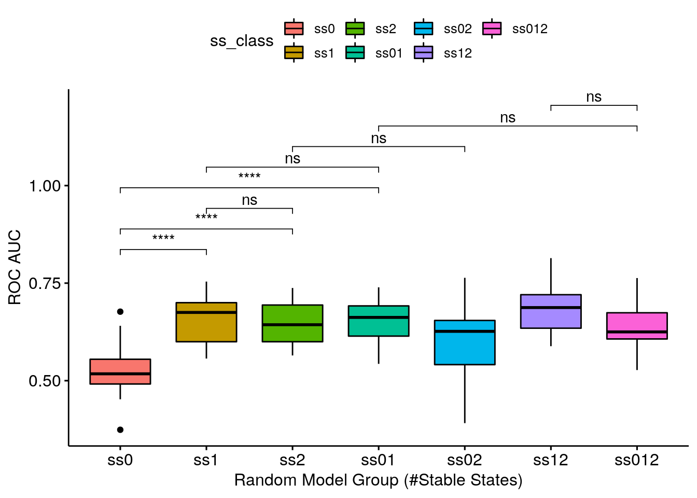
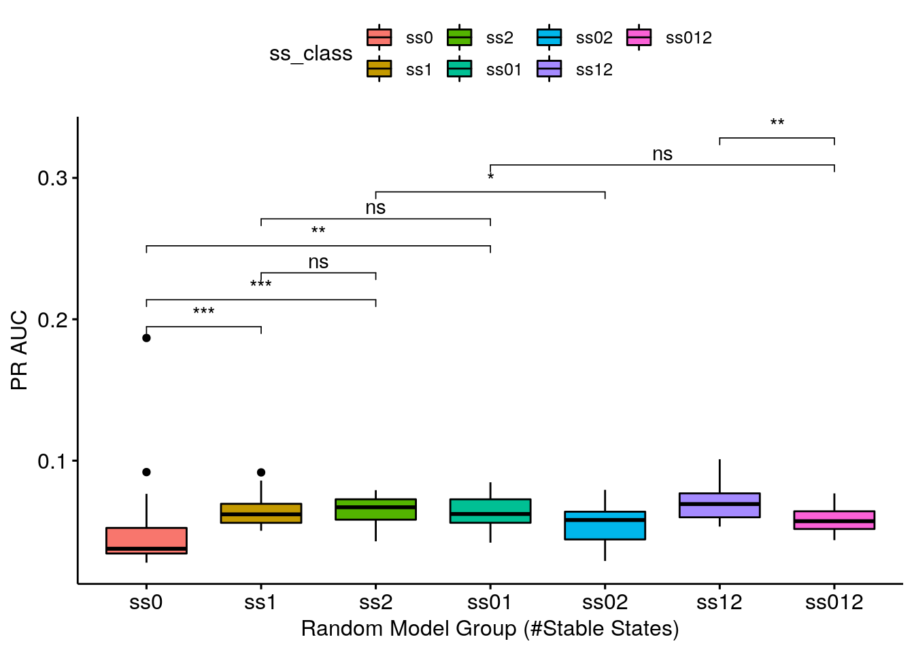
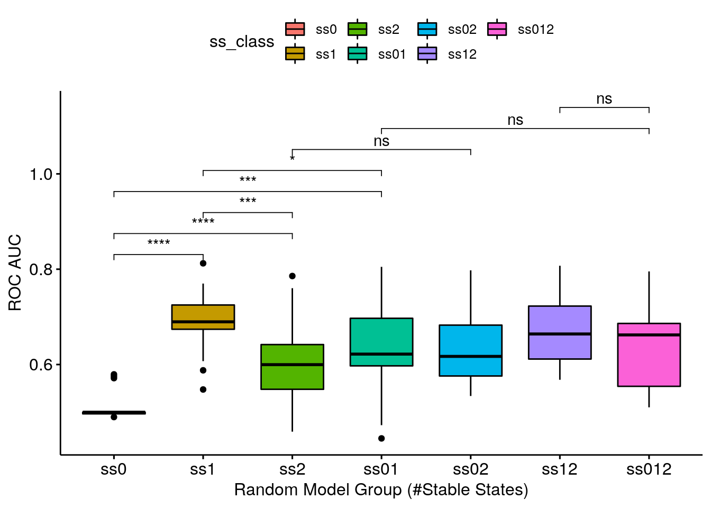
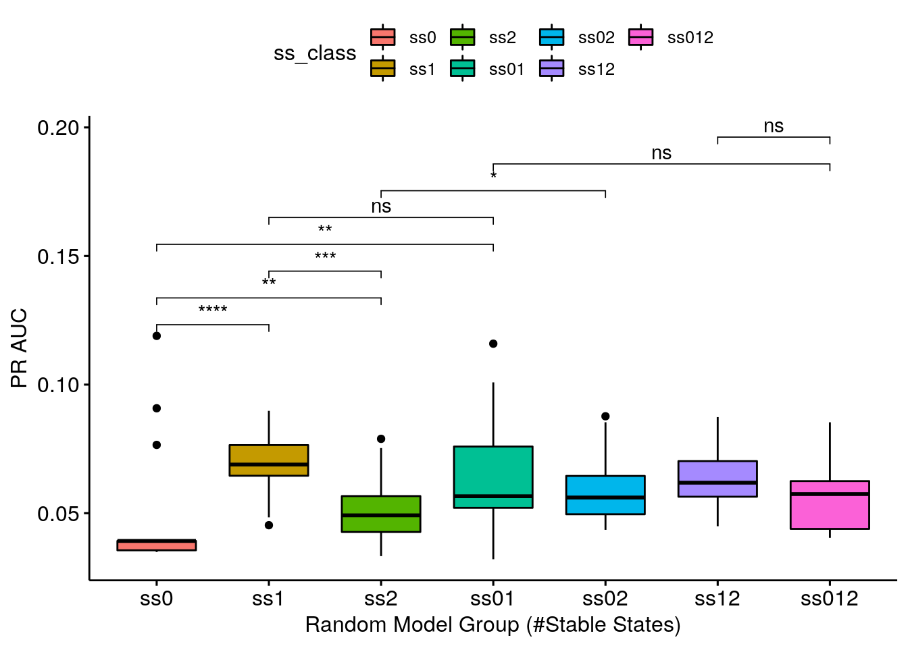

# Intro {-}

:::{.green-box}
Main question: is there a relation between *random* models **stable state number** and their **performance** as measured by AUC PR (Precision-Recall) or AUC ROC (Receiver Operatoring Characteristic)?
:::

This investigation can be considered as an extension of the random model ROC and PR curves (for CASCADE 2.0, link operator mutations) I created for the AGS paper (see version tagged `v1.0` which included the abmlog-generated random model analysis [here](https://github.com/bblodfon/ags-paper-1/releases/tag/v1.0)).
In that analysis, I generated a $3000$ random model sample, and took only the models that had 1 stable state to compute their ROC performance. 
So maybe I neede to generate more models or bootstrap (re-sample) these models to get a better picture of what is going on and that's what I am trying to do here :)

# Input {-}

The *random link-operator mutated* models were generated from the **CASCADE 2.0** topology, using the [abmlog software](https://github.com/druglogics/abmlog), version `1.6.0`.
Their prediction performance was assessed by the `Drabme` software module, via the `druglogics-synergy` Java module, version `1.2.0`.

I run the following command to get the random models from the `abmlog` repo root (took ~165 min to **generate all $50000$ models**):

```r
java -cp target/abmlog-1.6.0-jar-with-dependencies.jar eu.druglogics.abmlog.RandomBooleanModelGenerator --file=test/cascade_2_0.sif --num=50000
```

---

I splitted the models to **3 groups**: those that have no 1 stable state, 2 stable states or none at all.
There was only 1 model in $50000$ (`cascade_2_0_418669279901714.gitsbe`) that had 3 stable states and so we will not take into account models with more than 2 stable states (very rare and almost impossible to be chosen via `Gitsbe` since it indirectly penalizes models with more than 1 attractors).
The distribution of models in each category were (use the [count_ss.sh](https://raw.githubusercontent.com/druglogics/gitsbe-model-analysis/master/cascade/random-model-ss/data/count_ss.sh) script):

| #Stable states | #Models | Percentage |
|---|---|---|
| 0 | 29027 | 58% |
| 1 | 20672 | 41% |
| 2 | 300   | 1%  |
| 3 | 1     | less than 0.01%  |

From the `ags_cascade_2.0` directory of the `druglogics-synergy` module I ran the [run.sh](https://raw.githubusercontent.com/druglogics/gitsbe-model-analysis/master/cascade/random-model-ss/data/run.sh) script.
This script bootstraps $50$ models ($20$ times in total) from each category and runs the Drabme with those.
So bootstraping $50$ models $\times \text{ }20$ times with 0 stable states, $50$ models $\times \text{ }20$ times with 1 stable state, etc.
We also try all pair-wise combinations: {($25$ models with 0 stable states) + ($25$ models with 1 stable state)} $\times\text{ }20$ times, etc.
Lastly, we merge all of the different stable state models together in a pool of $25\times3=75$ models (again bootstraping $20$ such samples).

:::{.orange-box}
The generated random models and the results of the `Drabme` simulations are stored in 
[](https://doi.org/10.5281/zenodo.3932382)
:::

# Libraries {-}


```r
library(emba)
library(stringr)
library(xfun)
library(PRROC)
library(dplyr)
library(ggpubr)
```

# Analysis {-}

Note that `data_dir` in the next code-block is the directory where you uncompress the Zenodo dataset file (`tar -xzvf boot_random_ss.tar.gz`).
The `ss_class` denotes the model group.
E.g. `ss0` is the group with models with zero stable state, `ss12` is the group with half the models having 1 stable state and half of the others having 2 stable states, etc.


```r
observed_synergies_file = "data/observed_synergies_cascade_2.0"
observed_synergies = emba::get_observed_synergies(observed_synergies_file)

data_dir = "/home/john/tmp/ags_paper_res/link-only/hsa/bootstrap_random_ss"
res_dirs = list.files(data_dir, full.names = TRUE)

data_list = list()
index = 1
for (dir in res_dirs) {
  if (stringr::str_detect(string = dir, pattern = "cascade_2.0_random_hsa_ss")) {
    # How many stable states the models had?
    ss_class = str_match(string = dir, pattern = "_(ss\\d+)_")[1,2]
    
    # Get the ensemble-wise synergies
    ew_syn_file = list.files(path = dir, pattern = "_ensemblewise_synergies.tab", full.names = TRUE)
    ew_synergies = emba::get_synergy_scores(ew_syn_file)
    
    observed = sapply(ew_synergies$perturbation %in% observed_synergies, as.integer)
    
    # ROC AUC (Ensemble-wise)
    ew_roc = roc.curve(scores.class0 = ew_synergies %>% pull(score) %>% (function(x) {-x}), 
      weights.class0 = observed)
    ew_roc_auc = ew_roc$auc
    
    # PR AUC (Ensemble-wise)
    ew_pr = pr.curve(scores.class0 = ew_synergies %>% pull(score) %>% (function(x) {-x}), 
  weights.class0 = observed)
    ew_pr_auc = ew_pr$auc.davis.goadrich
    
    # Get the model-wise synergies
    mw_syn_file = list.files(path = dir, pattern = "_modelwise_synergies.tab", full.names = TRUE)
    mw_synergies = emba::get_synergy_scores(mw_syn_file, file_type = "modelwise")
    
    mw_synergies = mw_synergies %>% 
      mutate(synergy_prob = case_when(
        synergies == 0 & `non-synergies` == 0 ~ 0, 
        TRUE ~ synergies/(synergies + `non-synergies`)))
    
    # ROC AUC (Model-wise)
    mw_roc = roc.curve(scores.class0 = mw_synergies %>% pull(synergy_prob), weights.class0 = observed)
    mw_roc_auc = mw_roc$auc
    
    # PR AUC (Model-wise)
    mw_pr = pr.curve(scores.class0 = mw_synergies %>% pull(synergy_prob), weights.class0 = observed)
    mw_pr_auc = mw_pr$auc.davis.goadrich
    
    # Merge results
    data_list[[index]] = dplyr::bind_cols(ss_class = ss_class, 
      roc_auc = ew_roc_auc, pr_auc = ew_pr_auc, method = "ensemble-wise")
    index = index + 1
    data_list[[index]] = dplyr::bind_cols(ss_class = ss_class, 
      roc_auc = mw_roc_auc, pr_auc = mw_pr_auc, method = "model-wise")
    index = index + 1
  }
}

res = dplyr::bind_rows(data_list)

saveRDS(res, file = "data/res.rds")
```

We will just load the result for efficiency:

```r
res = readRDS(file = "data/res.rds")
```

## Ensemble-wise Synergies {-}


```r
my_comparisons = list(c("ss0", "ss1"), c("ss0", "ss2"), c("ss1", "ss2"), 
  c("ss0", "ss01"), c("ss1", "ss01"), c("ss2", "ss02"), c("ss01", "ss012"),  c("ss12", "ss012"))
ggboxplot(data = res %>% filter(method == "ensemble-wise"), 
  x = "ss_class", y = "roc_auc", fill = "ss_class",
  xlab = "Random Model Group (#Stable States)", ylab = "ROC AUC",
  order = c("ss0", "ss1", "ss2", "ss01", "ss02", "ss12", "ss012")) + 
  stat_compare_means(comparisons = my_comparisons, method = "wilcox.test", label = "p.signif")
```



```r
ggboxplot(data = res %>% filter(method == "ensemble-wise"),
  x = "ss_class", y = "pr_auc", fill = "ss_class", 
  xlab = "Random Model Group (#Stable States)", ylab = "PR AUC",
  order = c("ss0", "ss1", "ss2", "ss01", "ss02", "ss12", "ss012")) +
  stat_compare_means(comparisons = my_comparisons, method = "wilcox.test", label = "p.signif")
```



- ROC AUC results are somewhat analogous to the PR AUC results
- Getting a **complete random sample of models with 1 stable state** is enough to give you a *valid* ROC AUC (average AUC: 0.659212) - the *ss1* group is one of the highest-performing groups
- Getting a **decent random sample** (keeping true to the models proportions as seeing in the table above) means being close to what the class *ss01* represents.
The class **ss01** is 50-50 and a genuine decent random sample would be ~60-40 (60% models with 0 stable states and 40% models with 1 stable state), but we see that the 0 stable state models do not add *AUC points* (if I am allowed such terminology :) to any group that they are combined with!
- Continuing, the *ss01* group is **indistiguisable performance-wise** from the *ss1* group - meaning that **using just the $1$ stable state models as a random sample for this topology (CASCADE 2.0) is a good enough choice**!

## Model-wise Synergies {-}


```r
ggboxplot(data = res %>% filter(method == "model-wise"),
  x = "ss_class", y = "roc_auc", fill = "ss_class",
  xlab = "Random Model Group (#Stable States)", ylab = "ROC AUC",
  order = c("ss0", "ss1", "ss2", "ss01", "ss02", "ss12", "ss012")) +
  stat_compare_means(comparisons = my_comparisons, method = "wilcox.test", label = "p.signif")
```



```r
ggboxplot(data = res %>% filter(method == "model-wise"),
  x = "ss_class", y = "pr_auc", fill = "ss_class",
  xlab = "Random Model Group (#Stable States)", ylab = "PR AUC",
  order = c("ss0", "ss1", "ss2", "ss01", "ss02", "ss12", "ss012")) + 
  stat_compare_means(comparisons = my_comparisons, method = "wilcox.test", label = "p.signif")
```



- Same results as above.
Note that the model-wise methodology (used to calculate the synergy scores) seems to be more *granular*: it's easier to distinguish the different categories performance using this methodology.

# R session info {-}


```r
xfun::session_info()
```

```
R version 3.6.3 (2020-02-29)
Platform: x86_64-pc-linux-gnu (64-bit)
Running under: Ubuntu 20.04.1 LTS

Locale:
  LC_CTYPE=en_US.UTF-8       LC_NUMERIC=C              
  LC_TIME=en_US.UTF-8        LC_COLLATE=en_US.UTF-8    
  LC_MONETARY=en_US.UTF-8    LC_MESSAGES=en_US.UTF-8   
  LC_PAPER=en_US.UTF-8       LC_NAME=C                 
  LC_ADDRESS=C               LC_TELEPHONE=C            
  LC_MEASUREMENT=en_US.UTF-8 LC_IDENTIFICATION=C       

Package version:
  abind_1.4-5              assertthat_0.2.1         backports_1.1.10        
  base64enc_0.1.3          BH_1.72.0.3              bookdown_0.21           
  boot_1.3.25              broom_0.7.2              callr_3.5.1             
  car_3.0-10               carData_3.0-4            cellranger_1.1.0        
  Ckmeans.1d.dp_4.3.3      cli_2.1.0                clipr_0.7.1             
  colorspace_1.4-1         compiler_3.6.3           conquer_1.0.2           
  corrplot_0.84            cowplot_1.1.0            cpp11_0.2.3             
  crayon_1.3.4             curl_4.3                 data.table_1.13.2       
  desc_1.2.0               digest_0.6.27            dplyr_1.0.2             
  ellipsis_0.3.1           emba_0.1.8               evaluate_0.14           
  fansi_0.4.1              farver_2.0.3             forcats_0.5.0           
  foreign_0.8-75           gbRd_0.4-11              generics_0.0.2          
  ggplot2_3.3.2            ggpubr_0.4.0             ggrepel_0.8.2           
  ggsci_2.9                ggsignif_0.6.0           glue_1.4.2              
  graphics_3.6.3           grDevices_3.6.3          grid_3.6.3              
  gridExtra_2.3            gtable_0.3.0             haven_2.3.1             
  highr_0.8                hms_0.5.3                htmltools_0.5.0         
  htmlwidgets_1.5.2        igraph_1.2.6             isoband_0.2.2           
  jsonlite_1.7.1           knitr_1.30               labeling_0.4.2          
  lattice_0.20.41          lifecycle_0.2.0          lme4_1.1.25             
  magrittr_1.5             maptools_1.0.2           markdown_1.1            
  MASS_7.3.53              Matrix_1.2.18            MatrixModels_0.4.1      
  matrixStats_0.57.0       methods_3.6.3            mgcv_1.8.33             
  mime_0.9                 minqa_1.2.4              munsell_0.5.0           
  nlme_3.1.149             nloptr_1.2.2.2           nnet_7.3.14             
  openxlsx_4.2.2           parallel_3.6.3           pbkrtest_0.4.8.6        
  pillar_1.4.6             pkgbuild_1.1.0           pkgconfig_2.0.3         
  pkgload_1.1.0            polynom_1.4.0            praise_1.0.0            
  prettyunits_1.1.1        processx_3.4.4           progress_1.2.2          
  PRROC_1.3.1              ps_1.4.0                 purrr_0.3.4             
  quantreg_5.74            R6_2.4.1                 rbibutils_1.3           
  RColorBrewer_1.1.2       Rcpp_1.0.5               RcppArmadillo_0.10.1.0.0
  RcppEigen_0.3.3.7.0      Rdpack_2.0               readr_1.4.0             
  readxl_1.3.1             rematch_1.0.1            rio_0.5.16              
  rje_1.10.16              rlang_0.4.8              rmarkdown_2.5           
  rprojroot_1.3.2          rstatix_0.6.0            rstudioapi_0.11         
  scales_1.1.1             sp_1.4.4                 SparseM_1.78            
  splines_3.6.3            statmod_1.4.35           stats_3.6.3             
  stringi_1.5.3            stringr_1.4.0            testthat_2.3.2          
  tibble_3.0.4             tidyr_1.1.2              tidyselect_1.1.0        
  tinytex_0.26             tools_3.6.3              usefun_0.4.8            
  utf8_1.1.4               utils_3.6.3              vctrs_0.3.4             
  viridisLite_0.3.0        visNetwork_2.0.9         withr_2.3.0             
  xfun_0.18                xml2_1.3.2               yaml_2.2.1              
  zip_2.1.1               
```

# References {-}
